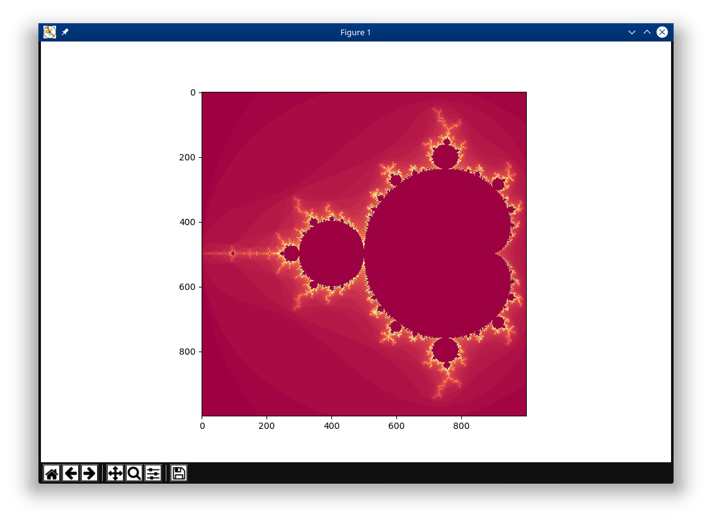

[](https://mybinder.org/v2/gh/DanielDondorp/MandelbrotZoom/master)


# MandelbrotZoom
Simple python app to explore the mandelbrot set

### Getting started

Clone this repository by downloading and extracting the zip or by running
```
git clone https://github.com/DanielDondorp/MandelbrotZoom.git
```
Go into the directory and install the dependencies. I recommend installing into a virtual environment.
``` 
cd MandelbrotZoom
pip install -r requirements.txt
```

Run the program:
```
python Mandelbrot_Zoom_app.py
```

### Controls:

* `arrow keys` for panning
* `enter` to zoom in
* `backspace` to zoom out
* `page up` and `page down` to change resolution \*
* `a` and `z` to change colormap
* `d` to save the current view as png
* `double-click` on a region to zoom specifically there

\* this changes how many iterations are calculated to create the image.




### Notebooks
The notebooks in this repository offer implementations of this program that run in a jupyter notebook. Mandelbrot_notebook.ipynb offers control of colormaps, iterations and resolution using ipywidgets. The controls are slightly different but pretty intuitive. Zoom in and out with left and right clicks, and do the rest with widgets.
